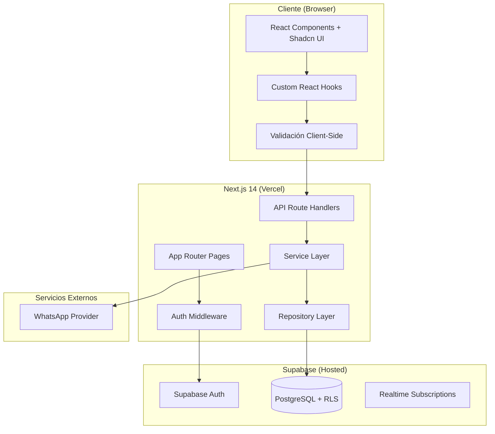
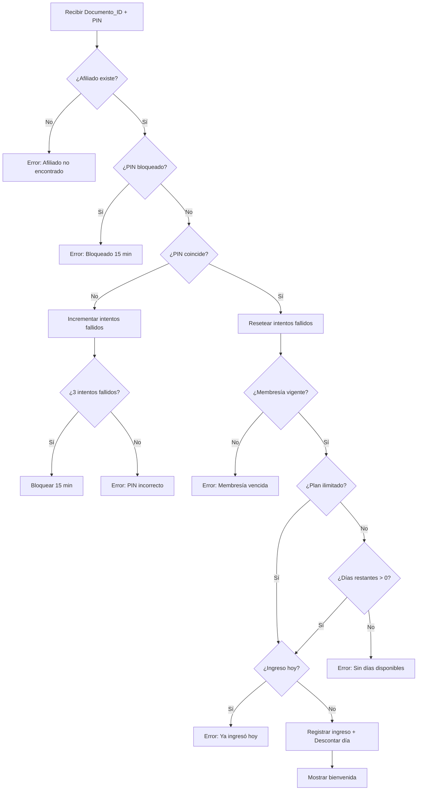
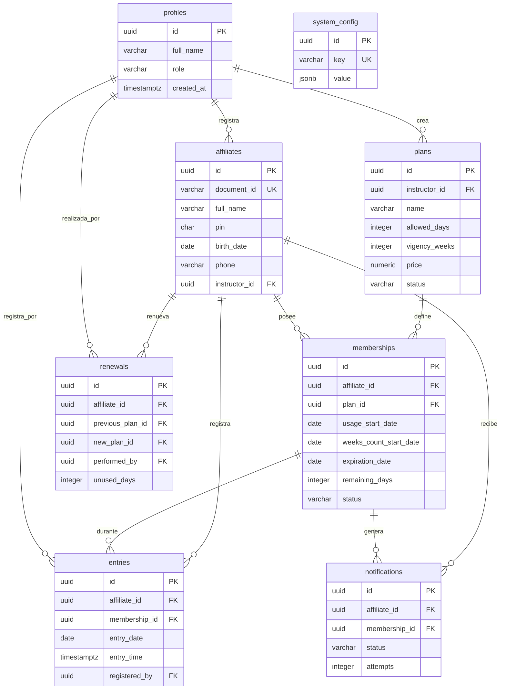
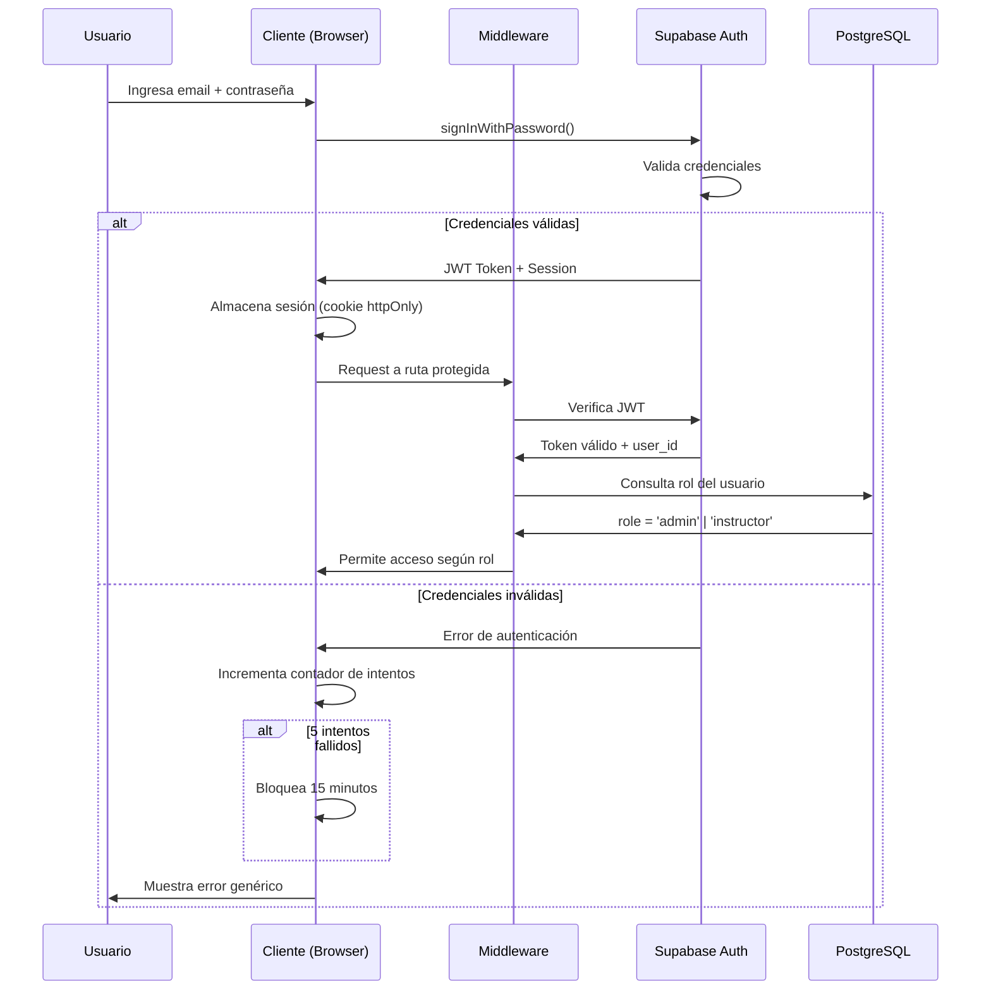
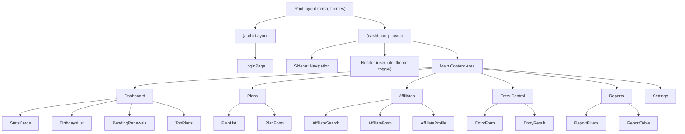

# Technical Design Document

## Overview

Este documento describe el diseño técnico de **UruzTraining**, una aplicación web de gestión de membresías de gimnasio. El sistema permite a administradores e instructores gestionar afiliados, planes de suscripción, control de ingreso mediante documento y PIN, seguimiento de vencimientos, notificaciones vía WhatsApp y visualización de tableros operacionales.

### Stack Tecnológico

| Capa | Tecnología |
|------|-----------|
| Frontend | Next.js 14 (App Router), React 18, TypeScript, Tailwind CSS, Shadcn UI |
| Backend | Next.js API Routes (Route Handlers) |
| Base de datos | Supabase PostgreSQL con RLS |
| Autenticación | Supabase Auth |
| Hosting | Vercel (free tier) |
| Iconos | Lucide React |

### Decisiones Clave de Diseño

1. **Patrón Repositorio**: Separación clara entre lógica de negocio y acceso a datos para facilitar testing y mantenimiento.
2. **Capa de Servicios**: Toda la lógica de negocio (cálculo de vigencia, validación de ingreso) reside en servicios puros e inyectables.
3. **RLS como primera línea de defensa**: Las políticas de Row Level Security en Supabase garantizan aislamiento de datos incluso si la capa de aplicación tiene errores.
4. **Interfaz abstracta de notificaciones**: El servicio de notificaciones usa el patrón Strategy para permitir cambio de proveedor (Twilio, Meta API) sin modificar lógica de negocio.
5. **Expiración dual**: Las membresías vencen por el criterio más restrictivo entre días consumidos y tiempo transcurrido.

## Architecture

### Diagrama de Arquitectura General



### Flujo de Datos

1. El usuario interactúa con componentes React que usan custom hooks para gestionar estado.
2. Los hooks invocan API Route Handlers de Next.js.
3. El middleware de autenticación valida el token JWT en cada request protegido.
4. Los Route Handlers delegan a la capa de servicios para lógica de negocio.
5. Los servicios usan repositorios para operaciones de base de datos.
6. Supabase RLS aplica restricciones de acceso a nivel de fila según el rol del usuario autenticado.

### Estructura de Carpetas

```
src/
├── app/
│   ├── (auth)/
│   │   └── login/
│   │       └── page.tsx
│   ├── (dashboard)/
│   │   ├── layout.tsx
│   │   ├── page.tsx                    # Tablero principal
│   │   ├── plans/
│   │   │   ├── page.tsx               # Listado de planes
│   │   │   └── [id]/page.tsx          # Detalle/edición de plan
│   │   ├── affiliates/
│   │   │   ├── page.tsx               # Búsqueda y listado
│   │   │   ├── new/page.tsx           # Registro de afiliado
│   │   │   └── [id]/page.tsx          # Perfil del afiliado
│   │   ├── entry/
│   │   │   └── page.tsx               # Control de ingreso
│   │   ├── reports/
│   │   │   └── page.tsx               # Informes
│   │   └── settings/
│   │       └── page.tsx               # Configuración del sistema
│   └── api/
│       ├── auth/
│       │   └── [...nextauth]/route.ts
│       ├── plans/
│       │   └── route.ts
│       ├── affiliates/
│       │   ├── route.ts
│       │   └── [id]/
│       │       ├── route.ts
│       │       ├── pin/route.ts
│       │       └── renew/route.ts
│       ├── entry/
│       │   └── route.ts
│       ├── reports/
│       │   └── route.ts
│       ├── notifications/
│       │   └── route.ts
│       └── settings/
│           └── route.ts
├── lib/
│   ├── supabase/
│   │   ├── client.ts                  # Cliente browser
│   │   ├── server.ts                  # Cliente server-side
│   │   └── admin.ts                   # Cliente service-role
│   ├── types/
│   │   ├── database.ts                # Tipos generados de Supabase
│   │   ├── api.ts                     # Tipos de request/response
│   │   └── domain.ts                  # Tipos de dominio
│   ├── validators/
│   │   ├── plan.validator.ts
│   │   ├── affiliate.validator.ts
│   │   ├── entry.validator.ts
│   │   └── common.validator.ts
│   └── utils/
│       ├── date.utils.ts              # Utilidades de fecha/vigencia
│       ├── format.utils.ts
│       └── constants.ts
├── services/
│   ├── auth.service.ts
│   ├── plan.service.ts
│   ├── affiliate.service.ts
│   ├── entry.service.ts
│   ├── membership.service.ts
│   ├── renewal.service.ts
│   ├── notification.service.ts        # Interfaz abstracta
│   ├── whatsapp.service.ts            # Implementación concreta
│   ├── report.service.ts
│   └── vigency.service.ts             # Cálculo de vigencia
├── repositories/
│   ├── plan.repository.ts
│   ├── affiliate.repository.ts
│   ├── membership.repository.ts
│   ├── entry.repository.ts
│   ├── renewal.repository.ts
│   ├── notification.repository.ts
│   └── config.repository.ts
├── hooks/
│   ├── use-auth.ts
│   ├── use-plans.ts
│   ├── use-affiliates.ts
│   ├── use-entry.ts
│   ├── use-dashboard.ts
│   ├── use-reports.ts
│   └── use-theme.ts
└── components/
    ├── ui/                            # Shadcn UI components
    ├── layout/
    │   ├── sidebar.tsx
    │   ├── header.tsx
    │   └── main-layout.tsx
    ├── dashboard/
    │   ├── stats-cards.tsx
    │   ├── birthdays-list.tsx
    │   ├── pending-renewals.tsx
    │   └── top-plans.tsx
    ├── plans/
    │   ├── plan-form.tsx
    │   └── plan-list.tsx
    ├── affiliates/
    │   ├── affiliate-form.tsx
    │   ├── affiliate-search.tsx
    │   └── affiliate-profile.tsx
    ├── entry/
    │   ├── entry-form.tsx
    │   └── entry-result.tsx
    └── reports/
        ├── report-filters.tsx
        └── report-table.tsx
```

## Components and Interfaces

### Capa de Servicios

#### VigencyService

Responsable de calcular fechas de inicio y vencimiento de planes.

```typescript
interface VigencyCalculationInput {
  acquisitionDate: Date;
  plan: { allowedDays: number | 'unlimited'; vigencyWeeks: number };
  weekendStartRuleActive: boolean;
}

interface VigencyCalculationResult {
  usageStartDate: Date;       // Fecha desde la que puede usar el plan (descuento de días)
  weeksCountStartDate: Date;  // Fecha desde la que cuentan las semanas de vigencia
  expirationDate: Date;       // Fecha de vencimiento (basada en weeksCountStartDate)
}

interface IVigencyService {
  calculateVigency(input: VigencyCalculationInput): VigencyCalculationResult;
  isExpired(expirationDate: Date, now?: Date): boolean;
  getDaysUntilExpiration(expirationDate: Date, now?: Date): number;
}
```

**Algoritmo de Cálculo de Vigencia:**

```
1. Si la fecha de adquisición es Lun-Jue:
   → fecha_inicio_conteo_semanas = fecha_adquisición
   → fecha_inicio_uso = fecha_adquisición
2. Si la fecha de adquisición es Vie-Dom:
   a. Si Regla_Inicio_Fin_de_Semana ACTIVA:
      → fecha_inicio_conteo_semanas = siguiente lunes
      → fecha_inicio_uso = fecha_adquisición (puede usar días inmediatamente)
   b. Si Regla_Inicio_Fin_de_Semana INACTIVA:
      → fecha_inicio_conteo_semanas = fecha_adquisición
      → fecha_inicio_uso = fecha_adquisición
3. fecha_vencimiento = fecha_inicio_conteo_semanas + (semanas_vigencia × 7 días) - 1 día
   (El último día es inclusive hasta 23:59:59)
4. IMPORTANTE: Los días se descuentan desde fecha_inicio_uso.
   Si el usuario consume días durante el fin de semana "bonus" (entre fecha_adquisición
   y fecha_inicio_conteo_semanas), esos días SE descuentan del total del plan.
   El beneficio es que las semanas de vigencia no empiezan a correr hasta el lunes.
```

**Ejemplo:**
- Plan: 6 días / 2 semanas. Compra: Viernes 8 de mayo.
- fecha_inicio_uso = Viernes 8 mayo (puede ingresar y descuenta días)
- fecha_inicio_conteo_semanas = Lunes 11 mayo
- fecha_vencimiento = 11 mayo + 14 días - 1 = Domingo 24 mayo
- Si usa Vie 8, Sáb 9, Dom 10 → le quedan 3 días para consumir hasta el 24 mayo

#### EntryService

Responsable de la validación y registro de ingresos al gimnasio.

```typescript
interface EntryValidationResult {
  success: boolean;
  error?: {
    code: 'AFFILIATE_NOT_FOUND' | 'PIN_MISMATCH' | 'PIN_BLOCKED' |
          'MEMBERSHIP_EXPIRED' | 'NO_DAYS_REMAINING' | 'ALREADY_ENTERED';
    message: string;
    metadata?: Record<string, unknown>;
  };
  entry?: {
    affiliateName: string;
    planName: string;
    remainingDays: number | 'unlimited';
    expirationDate: Date;
  };
}

interface IEntryService {
  validateAndRegisterEntry(documentId: string, pin: string): Promise<EntryValidationResult>;
  getFailedAttempts(documentId: string): Promise<number>;
  isBlocked(documentId: string): Promise<boolean>;
}
```

**Flujo de Validación de Ingreso (Orden de Prioridad):**



#### NotificationService (Patrón Strategy)

Interfaz abstracta que permite intercambiar proveedores de mensajería sin modificar la lógica de negocio.

```typescript
interface NotificationPayload {
  recipientPhone: string;
  affiliateName: string;
  expirationDate: Date;
  templateId?: string;
}

interface NotificationResult {
  success: boolean;
  messageId?: string;
  error?: string;
}

// Interfaz abstracta
interface INotificationProvider {
  send(payload: NotificationPayload): Promise<NotificationResult>;
  getStatus(messageId: string): Promise<'sent' | 'delivered' | 'failed'>;
}

// Implementación concreta (intercambiable)
class WhatsAppNotificationProvider implements INotificationProvider {
  send(payload: NotificationPayload): Promise<NotificationResult>;
  getStatus(messageId: string): Promise<'sent' | 'delivered' | 'failed'>;
}

interface INotificationService {
  checkAndNotifyExpiringMemberships(): Promise<void>;
  sendNotification(affiliateId: string, payload: NotificationPayload): Promise<NotificationResult>;
  retryFailedNotifications(): Promise<void>;
}
```

**Estrategia de Reintentos:**
- Máximo 3 intentos por notificación
- Intervalo de 5 minutos entre intentos
- Registro de falla tras agotar reintentos (documento, teléfono, fecha vencimiento, error)
- Omisión silenciosa si el afiliado no tiene número registrado (con log de auditoría)

#### MembershipService

Gestiona la lógica de membresías activas, renovaciones y expiración.

```typescript
interface MembershipStatus {
  isActive: boolean;
  remainingDays: number | 'unlimited';
  expirationDate: Date;
  daysLost?: number; // Días perdidos por vencimiento temporal
}

interface RenewalInput {
  affiliateId: string;
  newPlanId: string;
  newInstructorId?: string;
  observations?: string;
}

interface IMembershipService {
  getStatus(affiliateId: string): Promise<MembershipStatus>;
  renew(input: RenewalInput, performedBy: string): Promise<void>;
  getExpiringMemberships(thresholdDays: number): Promise<Membership[]>;
}
```

### Capa de Repositorios

Cada repositorio encapsula las consultas a Supabase PostgreSQL, usando el cliente autenticado para que RLS se aplique automáticamente.

```typescript
interface IBaseRepository<T> {
  findById(id: string): Promise<T | null>;
  findMany(filters: Partial<T>, pagination?: PaginationParams): Promise<PaginatedResult<T>>;
  create(data: Omit<T, 'id' | 'created_at'>): Promise<T>;
  update(id: string, data: Partial<T>): Promise<T>;
}

interface PaginationParams {
  page: number;
  pageSize: number;
}

interface PaginatedResult<T> {
  data: T[];
  total: number;
  page: number;
  pageSize: number;
  totalPages: number;
}
```

### Custom React Hooks

Los hooks encapsulan la comunicación con la API y el estado local.

```typescript
// Hook de autenticación
function useAuth(): {
  user: User | null;
  role: 'admin' | 'instructor' | null;
  login: (email: string, password: string) => Promise<void>;
  logout: () => Promise<void>;
  isLoading: boolean;
  error: string | null;
};

// Hook de planes
function usePlans(): {
  plans: Plan[];
  createPlan: (data: CreatePlanInput) => Promise<void>;
  updatePlan: (id: string, data: UpdatePlanInput) => Promise<void>;
  deletePlan: (id: string) => Promise<void>;
  isLoading: boolean;
  error: string | null;
};

// Hook de control de ingreso
function useEntry(): {
  validateEntry: (documentId: string, pin: string) => Promise<EntryValidationResult>;
  lastResult: EntryValidationResult | null;
  isProcessing: boolean;
};
```

## Data Models

### Esquema de Base de Datos Completo

#### Tabla: `profiles`

Extiende `auth.users` de Supabase con información de rol y nombre.

| Columna | Tipo | Restricciones | Descripción |
|---------|------|---------------|-------------|
| id | uuid | PK, FK → auth.users(id) | ID del usuario autenticado |
| full_name | varchar(100) | NOT NULL | Nombre completo del usuario |
| role | varchar(20) | NOT NULL, CHECK (role IN ('admin', 'instructor')) | Rol del usuario |
| avatar_url | text | NULLABLE | URL del avatar |
| created_at | timestamptz | NOT NULL, DEFAULT now() | Fecha de creación |
| updated_at | timestamptz | NOT NULL, DEFAULT now() | Última actualización |

#### Tabla: `plans`

Paquetes de suscripción ofrecidos por los instructores.

| Columna | Tipo | Restricciones | Descripción |
|---------|------|---------------|-------------|
| id | uuid | PK, DEFAULT gen_random_uuid() | ID del plan |
| instructor_id | uuid | NOT NULL, FK → profiles(id) | Instructor creador |
| name | varchar(100) | NOT NULL | Nombre del plan |
| allowed_days | integer | NULLABLE, CHECK (allowed_days >= 1 OR allowed_days IS NULL) | Días permitidos (NULL = ilimitado) |
| vigency_weeks | integer | NOT NULL, CHECK (vigency_weeks >= 1) | Semanas de vigencia |
| price | numeric(10,2) | NOT NULL, CHECK (price >= 0) | Precio del plan |
| status | varchar(10) | NOT NULL, DEFAULT 'active', CHECK (status IN ('active', 'inactive')) | Estado |
| description | varchar(500) | NULLABLE | Descripción del plan |
| created_at | timestamptz | NOT NULL, DEFAULT now() | Fecha de creación |
| updated_at | timestamptz | NOT NULL, DEFAULT now() | Última actualización |

**Índices:** `idx_plans_instructor_id`, `idx_plans_status`

#### Tabla: `affiliates`

Miembros registrados del gimnasio.

| Columna | Tipo | Restricciones | Descripción |
|---------|------|---------------|-------------|
| id | uuid | PK, DEFAULT gen_random_uuid() | ID del afiliado |
| document_id | varchar(15) | NOT NULL, UNIQUE, CHECK (length >= 5) | Documento de identidad |
| full_name | varchar(100) | NOT NULL, CHECK (length >= 3) | Nombre completo |
| pin | char(4) | NOT NULL, CHECK (pin ~ '^[0-9]{4}$') | PIN de 4 dígitos |
| birth_date | date | NOT NULL, CHECK (birth_date <= CURRENT_DATE) | Fecha de nacimiento |
| phone | varchar(15) | NOT NULL, CHECK (length >= 7) | Número de celular |
| registration_date | date | NOT NULL, DEFAULT CURRENT_DATE | Fecha de registro |
| instructor_id | uuid | NOT NULL, FK → profiles(id) | Instructor responsable |
| observations | varchar(500) | NULLABLE | Observaciones |
| pin_failed_attempts | integer | NOT NULL, DEFAULT 0 | Intentos fallidos de PIN |
| pin_blocked_until | timestamptz | NULLABLE | Fecha/hora fin de bloqueo |
| created_at | timestamptz | NOT NULL, DEFAULT now() | Fecha de creación |
| updated_at | timestamptz | NOT NULL, DEFAULT now() | Última actualización |

**Índices:** `idx_affiliates_document_id` (UNIQUE), `idx_affiliates_instructor_id`, `idx_affiliates_phone`, `idx_affiliates_full_name_trgm` (GIN trigram para búsqueda parcial)

#### Tabla: `memberships`

Períodos activos e históricos de membresía para cada afiliado.

| Columna | Tipo | Restricciones | Descripción |
|---------|------|---------------|-------------|
| id | uuid | PK, DEFAULT gen_random_uuid() | ID de la membresía |
| affiliate_id | uuid | NOT NULL, FK → affiliates(id) | Afiliado dueño |
| plan_id | uuid | NOT NULL, FK → plans(id) | Plan asociado |
| usage_start_date | date | NOT NULL | Fecha desde la que puede usar el plan (descuento de días) |
| weeks_count_start_date | date | NOT NULL | Fecha desde la que cuentan las semanas de vigencia |
| expiration_date | date | NOT NULL | Fecha de vencimiento (basada en weeks_count_start_date + semanas) |
| remaining_days | integer | NULLABLE, CHECK (remaining_days >= 0 OR remaining_days IS NULL) | Días restantes (NULL = ilimitado) |
| status | varchar(15) | NOT NULL, DEFAULT 'active', CHECK (status IN ('active', 'expired', 'renewed')) | Estado de la membresía |
| days_lost | integer | NULLABLE, DEFAULT 0 | Días perdidos por vencimiento temporal |
| expired_detected_at | timestamptz | NULLABLE | Fecha en que se detectó la expiración |
| created_at | timestamptz | NOT NULL, DEFAULT now() | Fecha de creación |
| updated_at | timestamptz | NOT NULL, DEFAULT now() | Última actualización |

**Índices:** `idx_memberships_affiliate_id`, `idx_memberships_status`, `idx_memberships_expiration_date`

#### Tabla: `entries`

Registro de ingresos diarios al gimnasio.

| Columna | Tipo | Restricciones | Descripción |
|---------|------|---------------|-------------|
| id | uuid | PK, DEFAULT gen_random_uuid() | ID del ingreso |
| affiliate_id | uuid | NOT NULL, FK → affiliates(id) | Afiliado que ingresó |
| membership_id | uuid | NOT NULL, FK → memberships(id) | Membresía activa al momento |
| entry_date | date | NOT NULL, DEFAULT CURRENT_DATE | Fecha del ingreso |
| entry_time | timestamptz | NOT NULL, DEFAULT now() | Hora exacta del ingreso |
| registered_by | uuid | NOT NULL, FK → profiles(id) | Instructor que registró |
| created_at | timestamptz | NOT NULL, DEFAULT now() | Fecha de creación |

**Índices:** `idx_entries_affiliate_date` (UNIQUE composite: affiliate_id + entry_date), `idx_entries_entry_date`, `idx_entries_registered_by`

**Constraint UNIQUE:** `(affiliate_id, entry_date)` — previene ingresos duplicados en el mismo día.

#### Tabla: `renewals`

Historial inmutable de renovaciones de membresía.

| Columna | Tipo | Restricciones | Descripción |
|---------|------|---------------|-------------|
| id | uuid | PK, DEFAULT gen_random_uuid() | ID de la renovación |
| affiliate_id | uuid | NOT NULL, FK → affiliates(id) | Afiliado renovado |
| previous_plan_id | uuid | NOT NULL, FK → plans(id) | Plan anterior |
| new_plan_id | uuid | NOT NULL, FK → plans(id) | Plan nuevo |
| previous_membership_id | uuid | NOT NULL, FK → memberships(id) | Membresía anterior |
| new_membership_id | uuid | NOT NULL, FK → memberships(id) | Membresía nueva creada |
| renewal_date | timestamptz | NOT NULL, DEFAULT now() | Fecha de renovación |
| performed_by | uuid | NOT NULL, FK → profiles(id) | Instructor que renovó |
| unused_days | integer | NOT NULL, DEFAULT 0 | Días no usados del plan anterior |
| observations | varchar(500) | NULLABLE | Observaciones |
| created_at | timestamptz | NOT NULL, DEFAULT now() | Fecha de creación |

**Índices:** `idx_renewals_affiliate_id`, `idx_renewals_renewal_date`

**Política:** No se permiten DELETE ni UPDATE en esta tabla (inmutable).

#### Tabla: `notifications`

Log de notificaciones enviadas y su estado.

| Columna | Tipo | Restricciones | Descripción |
|---------|------|---------------|-------------|
| id | uuid | PK, DEFAULT gen_random_uuid() | ID de la notificación |
| affiliate_id | uuid | NOT NULL, FK → affiliates(id) | Afiliado destinatario |
| membership_id | uuid | NOT NULL, FK → memberships(id) | Membresía asociada |
| notification_type | varchar(30) | NOT NULL, DEFAULT 'expiration_reminder' | Tipo de notificación |
| status | varchar(20) | NOT NULL, DEFAULT 'pending', CHECK (status IN ('pending', 'sent', 'delivered', 'failed', 'skipped')) | Estado del envío |
| attempts | integer | NOT NULL, DEFAULT 0 | Número de intentos |
| last_attempt_at | timestamptz | NULLABLE | Fecha del último intento |
| next_retry_at | timestamptz | NULLABLE | Fecha del próximo reintento |
| phone_used | varchar(15) | NULLABLE | Teléfono usado para envío |
| error_message | text | NULLABLE | Mensaje de error si falló |
| external_message_id | varchar(100) | NULLABLE | ID del mensaje del proveedor |
| created_at | timestamptz | NOT NULL, DEFAULT now() | Fecha de creación |
| updated_at | timestamptz | NOT NULL, DEFAULT now() | Última actualización |

**Índices:** `idx_notifications_affiliate_membership` (UNIQUE composite: affiliate_id + membership_id + notification_type), `idx_notifications_status`

**Constraint UNIQUE:** `(affiliate_id, membership_id, notification_type)` — previene envíos duplicados por período de vencimiento.

#### Tabla: `system_config`

Parámetros configurables del sistema.

| Columna | Tipo | Restricciones | Descripción |
|---------|------|---------------|-------------|
| id | uuid | PK, DEFAULT gen_random_uuid() | ID del parámetro |
| key | varchar(50) | NOT NULL, UNIQUE | Clave del parámetro |
| value | jsonb | NOT NULL | Valor del parámetro |
| description | varchar(200) | NULLABLE | Descripción del parámetro |
| updated_by | uuid | NULLABLE, FK → profiles(id) | Último usuario que modificó |
| updated_at | timestamptz | NOT NULL, DEFAULT now() | Última modificación |

**Valores iniciales:**

| key | value | Descripción |
|-----|-------|-------------|
| weekend_start_rule | `{"active": true}` | Regla de inicio en fin de semana |
| notification_threshold_days | `{"days": 2}` | Umbral de notificación (días antes) |
| notification_time | `{"hour": 6, "minute": 0}` | Hora de ejecución diaria |
| notification_template | `{"template": "Hola {{nombre}}, tu membresía vence el {{fecha_vencimiento}}. ¡Renueva para seguir entrenando!"}` | Plantilla de mensaje |
| login_lockout_minutes | `{"minutes": 15}` | Minutos de bloqueo por intentos fallidos |
| login_max_attempts | `{"attempts": 5}` | Intentos máximos antes de bloqueo |
| pin_lockout_minutes | `{"minutes": 15}` | Minutos de bloqueo de PIN |
| pin_max_attempts | `{"attempts": 3}` | Intentos máximos de PIN |

### Diagrama Entidad-Relación



### Políticas RLS (Row Level Security)

#### Tabla `profiles`
- **SELECT**: Todos los usuarios autenticados pueden ver su propio perfil. Admin puede ver todos.
- **UPDATE**: Solo el propio usuario puede actualizar su perfil.

#### Tabla `plans`
- **SELECT**: Instructor ve solo sus planes. Admin ve todos.
- **INSERT**: Instructor puede crear planes (se asigna automáticamente como owner).
- **UPDATE**: Instructor solo modifica sus planes. Admin modifica cualquiera.
- **DELETE**: Solo Admin puede eliminar, y solo si el plan no tiene afiliados activos.

#### Tabla `affiliates`
- **SELECT**: Instructor ve solo afiliados asignados a él. Admin ve todos.
- **INSERT**: Instructor puede crear afiliados (se asigna automáticamente como instructor).
- **UPDATE**: Instructor solo modifica sus afiliados. Admin modifica cualquiera.
- **DELETE**: Solo Admin.

#### Tabla `memberships`
- **SELECT**: Instructor ve membresías de sus afiliados. Admin ve todas.
- **INSERT**: Instructor puede crear membresías para sus afiliados. Admin para cualquiera.
- **UPDATE**: Instructor solo actualiza membresías de sus afiliados. Admin actualiza cualquiera.
- **DELETE**: Prohibido para todos (historial inmutable).

#### Tabla `entries`
- **SELECT**: Instructor ve ingresos de sus afiliados. Admin ve todos.
- **INSERT**: Instructor puede registrar ingresos para sus afiliados. Admin para cualquiera.
- **UPDATE/DELETE**: Prohibido para todos.

#### Tabla `renewals`
- **SELECT**: Instructor ve renovaciones de sus afiliados. Admin ve todas.
- **INSERT**: Instructor puede crear renovaciones para sus afiliados. Admin para cualquiera.
- **UPDATE/DELETE**: Prohibido para todos (historial inmutable).

#### Tabla `notifications`
- **SELECT**: Solo Admin.
- **INSERT**: Solo sistema (service role).
- **UPDATE**: Solo sistema (service role).
- **DELETE**: Prohibido.

#### Tabla `system_config`
- **SELECT**: Todos los usuarios autenticados.
- **INSERT/UPDATE/DELETE**: Solo Admin.

### Implementación de Políticas RLS en SQL

```sql
-- Función auxiliar para obtener el rol del usuario autenticado
CREATE OR REPLACE FUNCTION public.get_user_role()
RETURNS text AS $$
  SELECT role FROM public.profiles WHERE id = auth.uid();
$$ LANGUAGE sql SECURITY DEFINER STABLE;

-- Función auxiliar para verificar si es admin
CREATE OR REPLACE FUNCTION public.is_admin()
RETURNS boolean AS $$
  SELECT EXISTS (
    SELECT 1 FROM public.profiles
    WHERE id = auth.uid() AND role = 'admin'
  );
$$ LANGUAGE sql SECURITY DEFINER STABLE;

-- ============ PLANS ============
ALTER TABLE public.plans ENABLE ROW LEVEL SECURITY;

CREATE POLICY "plans_select" ON public.plans FOR SELECT
  USING (instructor_id = auth.uid() OR public.is_admin());

CREATE POLICY "plans_insert" ON public.plans FOR INSERT
  WITH CHECK (instructor_id = auth.uid());

CREATE POLICY "plans_update" ON public.plans FOR UPDATE
  USING (instructor_id = auth.uid() OR public.is_admin());

CREATE POLICY "plans_delete" ON public.plans FOR DELETE
  USING (public.is_admin());

-- ============ AFFILIATES ============
ALTER TABLE public.affiliates ENABLE ROW LEVEL SECURITY;

CREATE POLICY "affiliates_select" ON public.affiliates FOR SELECT
  USING (instructor_id = auth.uid() OR public.is_admin());

CREATE POLICY "affiliates_insert" ON public.affiliates FOR INSERT
  WITH CHECK (instructor_id = auth.uid() OR public.is_admin());

CREATE POLICY "affiliates_update" ON public.affiliates FOR UPDATE
  USING (instructor_id = auth.uid() OR public.is_admin());

CREATE POLICY "affiliates_delete" ON public.affiliates FOR DELETE
  USING (public.is_admin());

-- ============ MEMBERSHIPS ============
ALTER TABLE public.memberships ENABLE ROW LEVEL SECURITY;

CREATE POLICY "memberships_select" ON public.memberships FOR SELECT
  USING (
    EXISTS (
      SELECT 1 FROM public.affiliates a
      WHERE a.id = affiliate_id AND (a.instructor_id = auth.uid() OR public.is_admin())
    )
  );

CREATE POLICY "memberships_insert" ON public.memberships FOR INSERT
  WITH CHECK (
    EXISTS (
      SELECT 1 FROM public.affiliates a
      WHERE a.id = affiliate_id AND (a.instructor_id = auth.uid() OR public.is_admin())
    )
  );

CREATE POLICY "memberships_update" ON public.memberships FOR UPDATE
  USING (
    EXISTS (
      SELECT 1 FROM public.affiliates a
      WHERE a.id = affiliate_id AND (a.instructor_id = auth.uid() OR public.is_admin())
    )
  );

-- ============ ENTRIES ============
ALTER TABLE public.entries ENABLE ROW LEVEL SECURITY;

CREATE POLICY "entries_select" ON public.entries FOR SELECT
  USING (
    EXISTS (
      SELECT 1 FROM public.affiliates a
      WHERE a.id = affiliate_id AND (a.instructor_id = auth.uid() OR public.is_admin())
    )
  );

CREATE POLICY "entries_insert" ON public.entries FOR INSERT
  WITH CHECK (registered_by = auth.uid() OR public.is_admin());

-- ============ RENEWALS ============
ALTER TABLE public.renewals ENABLE ROW LEVEL SECURITY;

CREATE POLICY "renewals_select" ON public.renewals FOR SELECT
  USING (
    EXISTS (
      SELECT 1 FROM public.affiliates a
      WHERE a.id = affiliate_id AND (a.instructor_id = auth.uid() OR public.is_admin())
    )
  );

CREATE POLICY "renewals_insert" ON public.renewals FOR INSERT
  WITH CHECK (performed_by = auth.uid() OR public.is_admin());

-- ============ NOTIFICATIONS ============
ALTER TABLE public.notifications ENABLE ROW LEVEL SECURITY;

CREATE POLICY "notifications_select" ON public.notifications FOR SELECT
  USING (public.is_admin());

-- ============ SYSTEM_CONFIG ============
ALTER TABLE public.system_config ENABLE ROW LEVEL SECURITY;

CREATE POLICY "system_config_select" ON public.system_config FOR SELECT
  USING (auth.uid() IS NOT NULL);

CREATE POLICY "system_config_modify" ON public.system_config FOR ALL
  USING (public.is_admin());
```

### API Endpoints (Next.js Route Handlers)

#### Autenticación

| Método | Ruta | Descripción | Roles |
|--------|------|-------------|-------|
| POST | `/api/auth/login` | Inicio de sesión | Público |
| POST | `/api/auth/logout` | Cierre de sesión | Autenticado |
| GET | `/api/auth/session` | Obtener sesión actual | Autenticado |

#### Planes

| Método | Ruta | Descripción | Roles |
|--------|------|-------------|-------|
| GET | `/api/plans` | Listar planes (filtrado por RLS) | Admin, Instructor |
| POST | `/api/plans` | Crear plan | Admin, Instructor |
| GET | `/api/plans/[id]` | Obtener plan por ID | Admin, Instructor |
| PUT | `/api/plans/[id]` | Actualizar plan | Admin, Instructor (owner) |
| DELETE | `/api/plans/[id]` | Eliminar plan | Solo Admin |

#### Afiliados

| Método | Ruta | Descripción | Roles |
|--------|------|-------------|-------|
| GET | `/api/affiliates` | Buscar afiliados (query params: search, field, page) | Admin, Instructor |
| POST | `/api/affiliates` | Registrar afiliado | Admin, Instructor |
| GET | `/api/affiliates/[id]` | Obtener perfil completo | Admin, Instructor |
| PUT | `/api/affiliates/[id]` | Actualizar afiliado | Admin, Instructor (owner) |
| DELETE | `/api/affiliates/[id]` | Eliminar afiliado | Solo Admin |
| PUT | `/api/affiliates/[id]/pin` | Actualizar PIN | Admin, Instructor (owner) |
| POST | `/api/affiliates/[id]/renew` | Renovar membresía | Admin, Instructor (owner) |

#### Control de Ingreso

| Método | Ruta | Descripción | Roles |
|--------|------|-------------|-------|
| POST | `/api/entry` | Registrar ingreso (body: document_id, pin) | Admin, Instructor |

#### Tablero

| Método | Ruta | Descripción | Roles |
|--------|------|-------------|-------|
| GET | `/api/dashboard` | Obtener métricas del tablero | Admin, Instructor |

#### Informes

| Método | Ruta | Descripción | Roles |
|--------|------|-------------|-------|
| GET | `/api/reports/entries` | Historial de ingresos | Admin, Instructor |
| GET | `/api/reports/renewals` | Historial de renovaciones | Admin, Instructor |
| GET | `/api/reports/expired` | Afiliados vencidos | Admin, Instructor |
| GET | `/api/reports/active` | Afiliados activos | Admin, Instructor |
| GET | `/api/reports/expiring` | Próximos a vencer | Admin, Instructor |
| GET | `/api/reports/entries-by-day` | Ingresos agrupados por día | Admin, Instructor |
| GET | `/api/reports/entries-by-month` | Ingresos agrupados por mes | Admin, Instructor |

#### Notificaciones

| Método | Ruta | Descripción | Roles |
|--------|------|-------------|-------|
| POST | `/api/notifications/check` | Ejecutar verificación de vencimientos | Solo Admin / CRON |
| GET | `/api/notifications` | Listar log de notificaciones | Solo Admin |

#### Configuración

| Método | Ruta | Descripción | Roles |
|--------|------|-------------|-------|
| GET | `/api/settings` | Obtener configuración del sistema | Admin, Instructor |
| PUT | `/api/settings/[key]` | Actualizar parámetro | Solo Admin |

### Flujo de Autenticación



**Decisiones de autenticación:**
- Se usa `@supabase/ssr` para manejar sesiones con cookies httpOnly en Next.js.
- El middleware de Next.js (`middleware.ts`) intercepta todas las rutas protegidas y verifica la sesión.
- El bloqueo por intentos fallidos se implementa en la capa de aplicación (no en Supabase Auth) usando la tabla `system_config` y un registro temporal en memoria o base de datos.

### Jerarquía de Componentes UI



## Correctness Properties

*Una propiedad es una característica o comportamiento que debería mantenerse verdadero en todas las ejecuciones válidas de un sistema—esencialmente, una declaración formal sobre lo que el sistema debe hacer. Las propiedades sirven como puente entre especificaciones legibles por humanos y garantías de corrección verificables por máquina.*

### Property 1: Cálculo de vigencia correcto

*Para cualquier* fecha de adquisición y configuración de plan (semanas de vigencia) y estado de Regla_Inicio_Fin_de_Semana, el cálculo de vigencia DEBE cumplir: (a) si la fecha es Lun-Jue, usage_start_date = weeks_count_start_date = acquisition_date; (b) si la fecha es Vie-Dom y la regla está activa, usage_start_date = acquisition_date Y weeks_count_start_date = siguiente lunes (el usuario puede usar días desde la compra, pero las semanas cuentan desde el lunes); (c) si la fecha es Vie-Dom y la regla está inactiva, usage_start_date = weeks_count_start_date = acquisition_date; y en todos los casos, expiration_date = weeks_count_start_date + (vigency_weeks × 7) - 1 días.

**Validates: Requirements 5.1, 5.2, 5.3, 5.4, 5.7**

### Property 2: Validación de PIN

*Para cualquier* cadena de caracteres, la validación de PIN DEBE aceptarla si y solo si la cadena coincide exactamente con el patrón `^[0-9]{4}$` (exactamente 4 dígitos numéricos).

**Validates: Requirements 3.3, 7.2**

### Property 3: Orden de prioridad en validación de ingreso

*Para cualquier* intento de ingreso con múltiples condiciones de falla simultáneas, el sistema DEBE retornar el código de error correspondiente a la falla de mayor prioridad según el orden: (1) afiliado no existe, (2) PIN bloqueado, (3) PIN no coincide, (4) membresía vencida, (5) sin días disponibles, (6) ingreso duplicado en el día.

**Validates: Requirements 6.8, 6.2, 6.3, 6.4, 6.5, 6.6, 6.7**

### Property 4: Aislamiento de datos por instructor (RLS)

*Para cualquier* instructor autenticado consultando planes, afiliados, membresías o ingresos, TODOS los registros retornados DEBEN pertenecer exclusivamente a ese instructor (instructor_id = usuario autenticado). Para cualquier recurso creado por un instructor, el campo instructor_id DEBE ser igual al ID del usuario autenticado.

**Validates: Requirements 2.2, 2.3, 3.5, 4.4, 10.3**

### Property 5: Filtrado exclusivo de planes activos en selección

*Para cualquier* contexto de selección de plan (registro de afiliado o renovación), la lista de planes disponibles DEBE contener únicamente planes con status = 'active'. Ningún plan con status = 'inactive' DEBE aparecer como opción seleccionable.

**Validates: Requirements 2.8, 3.8, 8.7**

### Property 6: Correctitud de búsqueda por campo

*Para cualquier* término de búsqueda de 3+ caracteres y cualquier campo de búsqueda (document_id, full_name, phone), TODOS los resultados retornados DEBEN contener el término de búsqueda como subcadena en el campo correspondiente (case-insensitive para nombre).

**Validates: Requirements 4.1, 4.2, 4.3**

### Property 7: Unicidad de documento de identidad

*Para cualquier* Documento_ID que ya existe en el sistema, un intento de crear un nuevo afiliado con el mismo Documento_ID DEBE ser rechazado y el registro existente DEBE permanecer sin modificaciones.

**Validates: Requirements 3.2**

### Property 8: Prevención de ingreso duplicado por día

*Para cualquier* afiliado que ya tiene un ingreso registrado en una fecha D, un segundo intento de ingreso en la misma fecha D DEBE ser rechazado con error de duplicidad.

**Validates: Requirements 6.6**

### Property 9: Completitud e inmutabilidad de renovaciones

*Para cualquier* renovación ejecutada, DEBE existir un registro en la tabla de renovaciones conteniendo: plan anterior, plan nuevo, fecha de renovación, instructor que realizó, días no utilizados y observaciones. Además, *para cualquier* registro de renovación existente, cualquier intento de eliminación o modificación DEBE ser rechazado.

**Validates: Requirements 8.4, 8.5**

### Property 10: Renovación crea membresía con parámetros del nuevo plan

*Para cualquier* renovación con un plan nuevo, la membresía resultante DEBE tener: remaining_days = allowed_days del nuevo plan (o NULL si ilimitado), y las fechas de vigencia calculadas según las reglas del Requisito 5 usando la fecha de renovación como fecha de adquisición.

**Validates: Requirements 8.1, 8.2, 8.6**

### Property 11: Unicidad de notificación por período de vencimiento

*Para cualquier* par (afiliado, membresía), ejecutar la verificación de notificaciones múltiples veces DEBE generar como máximo una única notificación, sin duplicados en verificaciones posteriores.

**Validates: Requirements 9.3**

### Property 12: Lógica de reintentos de notificación

*Para cualquier* notificación con status = 'failed' y attempts < 3, el sistema DEBE programar un reintento con next_retry_at = last_attempt_at + 5 minutos. *Para cualquier* notificación con attempts >= 3, el sistema DEBE marcarla como fallo definitivo sin programar más reintentos.

**Validates: Requirements 9.6**

### Property 13: Expiración dual de membresía

*Para cualquier* membresía de plan limitado, la membresía es inválida si remaining_days = 0 O si current_date > expiration_date (la condición más restrictiva aplica). *Para cualquier* membresía de plan ilimitado, la membresía es inválida únicamente si current_date > expiration_date. Cuando una membresía vence por tiempo con días restantes > 0, days_lost DEBE ser igual a remaining_days.

**Validates: Requirements 14.1, 14.2, 14.3, 14.4**

### Property 14: Bloqueo por intentos fallidos

*Para cualquier* entidad (login de usuario o PIN de afiliado) que acumula un número de intentos fallidos consecutivos >= umbral máximo configurado, el sistema DEBE bloquear nuevos intentos durante el período configurado (15 minutos por defecto).

**Validates: Requirements 1.7, 6.3**

### Property 15: Validación de entrada rechaza datos inválidos con errores específicos

*Para cualquier* entrada de datos que viola las restricciones de un campo (nombre vacío, precio negativo, documento fuera de rango 5-15 dígitos, fecha futura de nacimiento, etc.), el sistema DEBE rechazar la operación y retornar un error específico mencionando el campo y la regla violada.

**Validates: Requirements 2.7, 3.6**

### Property 16: Preservación de membresías existentes ante cambio de regla

*Para cualquier* membresía existente al momento de modificar la Regla_Inicio_Fin_de_Semana, su start_date y expiration_date DEBEN permanecer inalterados después de la modificación.

**Validates: Requirements 5.6**

### Property 17: Paginación no excede tamaño máximo

*Para cualquier* búsqueda que retorna resultados, cada página DEBE contener como máximo 20 registros.

**Validates: Requirements 4.6**

### Property 18: Búsqueda rechaza términos cortos

*Para cualquier* término de búsqueda con longitud menor a 3 caracteres, el sistema DEBE rechazar la consulta con un error de validación indicando el mínimo requerido.

**Validates: Requirements 4.8**

## Error Handling

### Estrategia General de Errores

El sistema implementa un manejo de errores en capas que separa la lógica interna de la respuesta al usuario.

#### Códigos de Error del Dominio

```typescript
enum ErrorCode {
  // Autenticación
  AUTH_INVALID_CREDENTIALS = 'AUTH_INVALID_CREDENTIALS',
  AUTH_ACCOUNT_LOCKED = 'AUTH_ACCOUNT_LOCKED',
  AUTH_SESSION_EXPIRED = 'AUTH_SESSION_EXPIRED',
  AUTH_INSUFFICIENT_PERMISSIONS = 'AUTH_INSUFFICIENT_PERMISSIONS',

  // Validación
  VALIDATION_REQUIRED_FIELD = 'VALIDATION_REQUIRED_FIELD',
  VALIDATION_INVALID_FORMAT = 'VALIDATION_INVALID_FORMAT',
  VALIDATION_OUT_OF_RANGE = 'VALIDATION_OUT_OF_RANGE',
  VALIDATION_MIN_LENGTH = 'VALIDATION_MIN_LENGTH',
  VALIDATION_MAX_LENGTH = 'VALIDATION_MAX_LENGTH',

  // Ingreso
  ENTRY_AFFILIATE_NOT_FOUND = 'ENTRY_AFFILIATE_NOT_FOUND',
  ENTRY_PIN_MISMATCH = 'ENTRY_PIN_MISMATCH',
  ENTRY_PIN_BLOCKED = 'ENTRY_PIN_BLOCKED',
  ENTRY_MEMBERSHIP_EXPIRED = 'ENTRY_MEMBERSHIP_EXPIRED',
  ENTRY_NO_DAYS_REMAINING = 'ENTRY_NO_DAYS_REMAINING',
  ENTRY_ALREADY_REGISTERED = 'ENTRY_ALREADY_REGISTERED',

  // Planes
  PLAN_NOT_FOUND = 'PLAN_NOT_FOUND',
  PLAN_INACTIVE = 'PLAN_INACTIVE',
  PLAN_HAS_ACTIVE_AFFILIATES = 'PLAN_HAS_ACTIVE_AFFILIATES',
  PLAN_NOT_OWNED = 'PLAN_NOT_OWNED',

  // Afiliados
  AFFILIATE_NOT_FOUND = 'AFFILIATE_NOT_FOUND',
  AFFILIATE_DUPLICATE_DOCUMENT = 'AFFILIATE_DUPLICATE_DOCUMENT',

  // Notificaciones
  NOTIFICATION_SEND_FAILED = 'NOTIFICATION_SEND_FAILED',
  NOTIFICATION_NO_PHONE = 'NOTIFICATION_NO_PHONE',

  // Sistema
  SYSTEM_INTERNAL_ERROR = 'SYSTEM_INTERNAL_ERROR',
  SYSTEM_DATABASE_ERROR = 'SYSTEM_DATABASE_ERROR',
}
```

#### Formato de Respuesta de Error API

```typescript
interface ApiErrorResponse {
  success: false;
  error: {
    code: ErrorCode;
    message: string; // Mensaje genérico para el usuario
    fields?: Record<string, string>; // Errores por campo (validación)
  };
}

interface ApiSuccessResponse<T> {
  success: true;
  data: T;
  meta?: {
    page?: number;
    pageSize?: number;
    total?: number;
    totalPages?: number;
  };
}
```

### Manejo de Errores por Capa

| Capa | Responsabilidad | Acción ante error |
|------|----------------|-------------------|
| Componente UI | Mostrar feedback al usuario | Toast/Alert con mensaje amigable |
| Hook | Gestionar estado de error | Capturar error, setear estado, limpiar loading |
| Route Handler | Validar request, formatear respuesta | Retornar ApiErrorResponse con código HTTP apropiado |
| Service | Lógica de negocio | Lanzar excepciones tipadas del dominio |
| Repository | Acceso a datos | Lanzar excepciones de DB traducidas |

### Códigos HTTP

| Situación | Código | Uso |
|-----------|--------|-----|
| Éxito | 200/201 | Operación completada |
| Validación inválida | 400 | Datos de entrada incorrectos |
| No autenticado | 401 | Token inválido o expirado |
| Sin permisos | 403 | Rol insuficiente para la operación |
| No encontrado | 404 | Recurso no existe |
| Conflicto | 409 | Duplicado (documento, ingreso) |
| Rate limit | 429 | Bloqueo por intentos fallidos |
| Error interno | 500 | Error inesperado (log completo servidor, respuesta genérica) |

### Logging de Errores

- **Errores 5xx**: Log completo con stack trace, contexto de operación, timestamp. Nunca exponer al cliente.
- **Errores 4xx**: Log básico para auditoría (quién, qué, cuándo).
- **Intentos fallidos de autenticación/PIN**: Log detallado para detección de ataques.
- **Notificaciones fallidas**: Log con datos suficientes para reintento manual.

## Testing Strategy

### Enfoque Dual de Testing

El proyecto utiliza un enfoque dual combinando tests unitarios basados en ejemplos y tests basados en propiedades para garantizar corrección comprehensiva.

### Herramientas de Testing

| Herramienta | Propósito |
|-------------|-----------|
| Vitest | Runner de tests unitarios y de propiedades |
| fast-check | Librería de property-based testing |
| @testing-library/react | Testing de componentes React |
| MSW (Mock Service Worker) | Mocking de API requests |

### Tests Unitarios (Basados en Ejemplos)

Los tests unitarios cubren:
- Casos específicos de integración con Supabase Auth (login exitoso, credenciales inválidas)
- Comportamiento de admin (ver todos los planes, eliminar planes)
- Casos de error específicos del UI (métricas que fallan en dashboard)
- Formato de informes y respuestas de API

**Alcance:** Verificar comportamiento concreto con datos específicos donde la variación de input no añade valor.

### Tests Basados en Propiedades (Property-Based Testing)

Los tests de propiedades cubren las 18 propiedades de corrección definidas en este documento, usando `fast-check` con Vitest.

**Configuración:**
- Mínimo 100 iteraciones por propiedad
- Cada test referencia su propiedad del documento de diseño
- Formato de tag: `Feature: gym-membership-management, Property {N}: {título}`

**Propiedades prioritarias para implementación:**
1. **Property 1** (Cálculo de vigencia) — Lógica pura, función determinista, alta variación de input
2. **Property 2** (Validación de PIN) — Lógica pura, espacio de input amplio
3. **Property 3** (Orden de prioridad de ingreso) — Lógica de negocio crítica con múltiples combinaciones
4. **Property 13** (Expiración dual) — Lógica de negocio con dos dimensiones de variación
5. **Property 6** (Correctitud de búsqueda) — Verificación de filtrado con datos generados
6. **Property 15** (Validación de entrada) — Cobertura de espacio de inputs inválidos

**Generadores personalizados necesarios:**
- `arbitraryDate()` — Fechas aleatorias cubriendo Lun-Dom, diferentes meses y años
- `arbitraryPlan()` — Planes válidos con variación en days (1-365, unlimited), weeks (1-52), price
- `arbitraryAffiliate()` — Afiliados con document_id (5-15 dígitos), PIN (4 dígitos), phone (7-15 dígitos)
- `arbitraryMembership()` — Membresías con diferentes estados (active, expired), remaining_days
- `arbitraryEntryAttempt()` — Combinaciones de condiciones de falla para test de prioridad

### Tests de Integración

Cubren:
- Flujo completo de autenticación con Supabase Auth
- Políticas RLS (verificar que instructor no puede ver datos ajenos)
- Flujo de notificaciones end-to-end (con mock del proveedor WhatsApp)
- Flujo de renovación completo (crear afiliado → asignar plan → renovar)

### Estructura de Tests

```
tests/
├── unit/
│   ├── services/
│   │   ├── vigency.service.test.ts
│   │   ├── entry.service.test.ts
│   │   ├── membership.service.test.ts
│   │   └── notification.service.test.ts
│   ├── validators/
│   │   ├── plan.validator.test.ts
│   │   ├── affiliate.validator.test.ts
│   │   └── entry.validator.test.ts
│   └── utils/
│       └── date.utils.test.ts
├── properties/
│   ├── vigency-calculation.property.test.ts
│   ├── pin-validation.property.test.ts
│   ├── entry-priority.property.test.ts
│   ├── dual-expiration.property.test.ts
│   ├── search-correctness.property.test.ts
│   ├── input-validation.property.test.ts
│   ├── rls-isolation.property.test.ts
│   ├── plan-filtering.property.test.ts
│   ├── renewal-completeness.property.test.ts
│   ├── notification-uniqueness.property.test.ts
│   ├── notification-retry.property.test.ts
│   ├── pagination.property.test.ts
│   └── lockout-threshold.property.test.ts
├── integration/
│   ├── auth-flow.test.ts
│   ├── rls-policies.test.ts
│   ├── entry-flow.test.ts
│   └── renewal-flow.test.ts
└── generators/
    ├── date.generator.ts
    ├── plan.generator.ts
    ├── affiliate.generator.ts
    ├── membership.generator.ts
    └── entry-attempt.generator.ts
```

